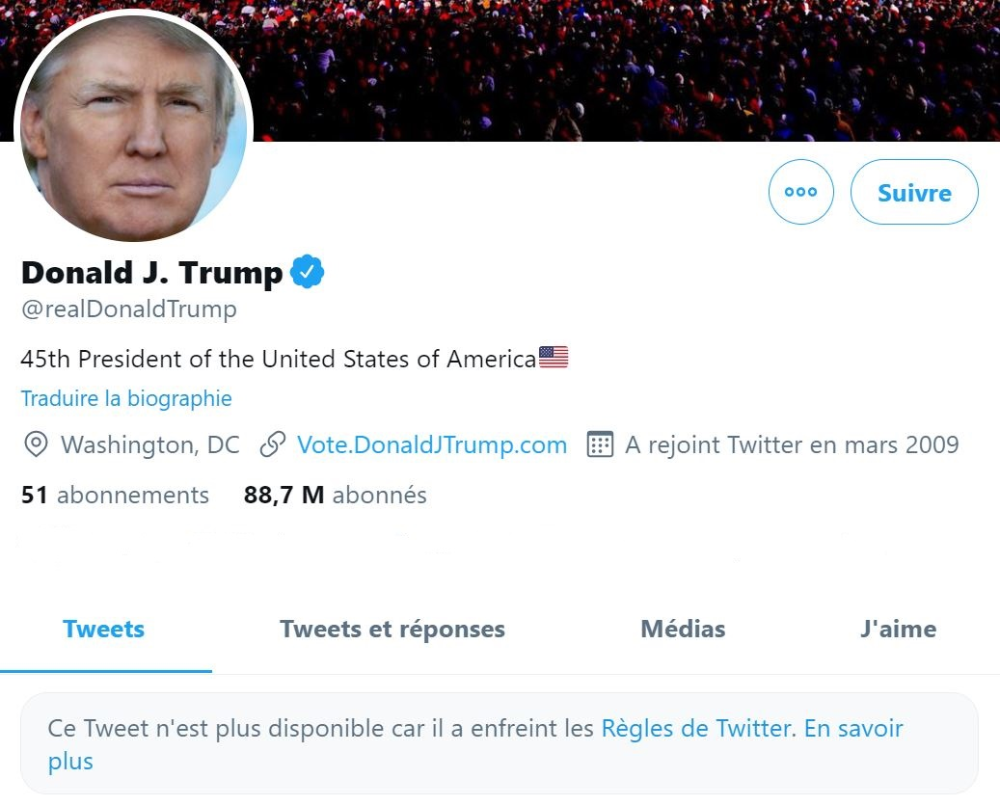
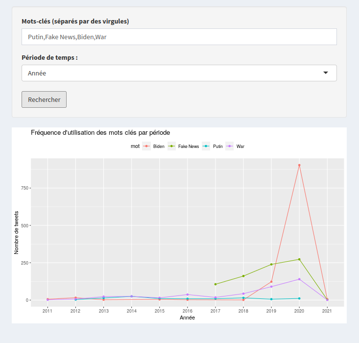

# Shiny Application - Donald Trump Tweets

This repository contains a Shiny application that provides an interface to explore and analyze the complete collection of **tweets by Donald Trump**. The application **allows users to perform keyword-based searches** across all the tweets, as well as retrieve information on the frequency of specific keywords and the number of times a word has been deleted.

[donald.cluster-2022-5.dopolytech.fr](http://donald.cluster-2022-5.dopolytech.fr/)

<p align="center">
    
</p>

## Table of Contents

  * [Technology stack](#technology-stack)
  * [Requirements](#requirements)
  * [Features](#features)
  * [Accessing the Application](#accessing-the-application)
  * [Run the application locally with docker](#run-the-application-locally-with-docker)
  * [Contributing](#contributing)
  * [License](#license)


## Technology stack

<p align="left">
    <a href="https://www.docker.com/" target="_blank" rel="noreferrer">
        
    </a>
    <a href="https://kubernetes.io" target="_blank" rel="noreferrer">
        
    </a>
    <a href="https://helm.sh/" target="_blank" rel="noreferrer">
        
    </a>
       <a href="https://helm.sh/" target="_blank" rel="noreferrer">
        
    </a>
</p>

## Requirements

Docker 

- [Docker](https://docs.docker.com/engine/reference/commandline/cli/)

Or 

- [R](https://www.r-project.org/)
- [RStudio](https://rstudio.com/)

## Features

- **Keyword Search:** Users can enter a keyword to search for tweets containing that specific word or phrase within Donald Trump's entire tweet history.

- **Keyword Frequency:** Users can input one or multiple keywords to retrieve the frequency count of each keyword within the tweets. Additionally, the application displays the number of times a keyword has been deleted from the tweets.

## Accessing the Application

The application is deployed and can be accessed at [donald.cluster-2022-5.dopolytech.fr](http://donald.cluster-2022-5.dopolytech.fr/)


<p align="center">
    
</p>

## Run the application locally with docker

The application has been containerized using Docker for easy deployment and portability. To launch the application, follow these steps:

1. Clone the repository to your local machine

```sh
git clone https://github.com/charley04310/do3-dataviz.git
```

2. Navigate to the root directory of the repository

```sh
cd do3-dataviz
```

3. Run the following command to build the Docker image:

```bash
docker build -t <your_image_name>:<tag> .
```

4. Run the following command to launch the application:

```bash
docker run -p 3838:3838 <your_image_name>
```

## Contributing

If you would like to contribute to this project, feel free to submit a pull request. Suggestions, bug reports, and feature requests are welcome. Please ensure to follow the established coding style and guidelines.

## License

[](https://lbesson.mit-license.org/)

This project is licensed under the **MIT License**.

Thank you for using the Shiny application to explore the complete collection of tweets by Donald Trump! If you have any questions or encounter any issues, please don't hesitate to reach out.


